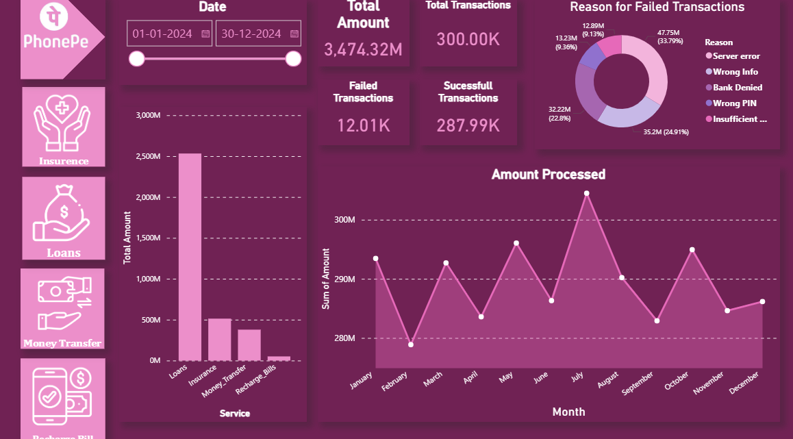
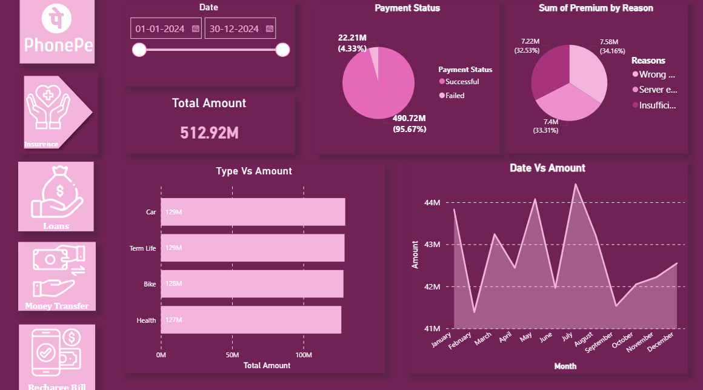
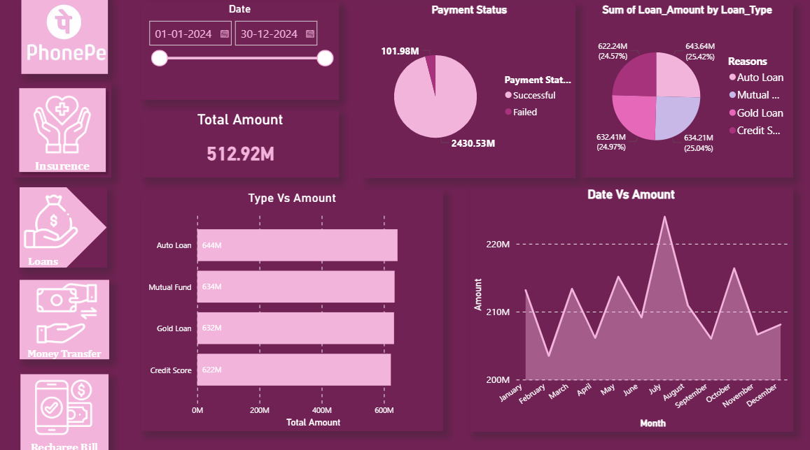
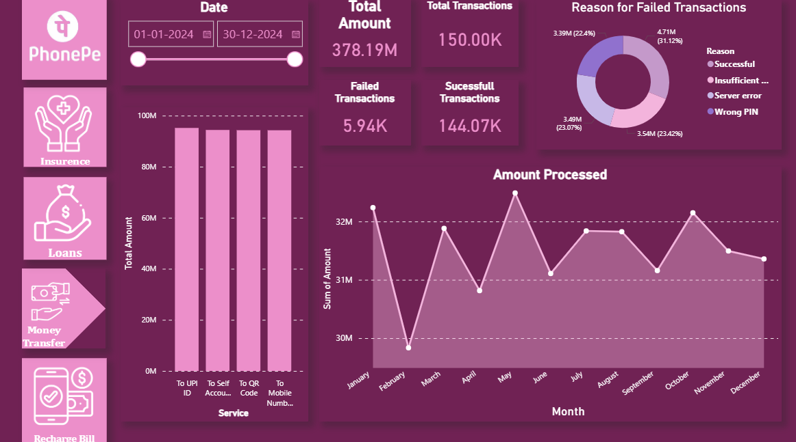
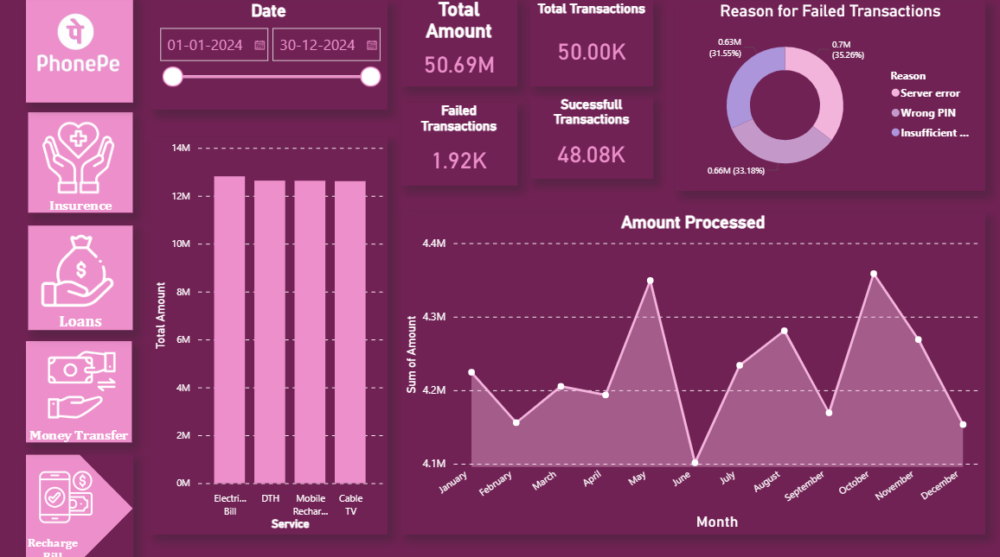

# 📊 PhonePe Business Analytics Dashboard (Excel + Power BI)
End-to-End Digital Payments Analytics Dashboard using Excel &amp; Power BI with KPI tracking, failure analysis, and interactive visualizations

## 🔍 Overview
This project analyzes digital transaction data inspired by PhonePe services, including Payments, Insurance, Loans, and Recharge. The goal is to monitor transaction performance, identify failure reasons, and derive actionable business insights.

## 🛠️ Tools Used
* Microsoft Excel → Data cleaning & preprocessing
* Power BI → Data visualization & dashboard creation
* DAX → KPI calculations

## 📊 Key Features
* 📅 Interactive date filter for dynamic analysis
* 💰 Total Amount & Transaction tracking
* ✅ Successful vs Failed Transactions breakdown
* ⚠️ Failure Reason Analysis (Server Error, Wrong PIN, etc.)
* 📈 Monthly trend analysis of transaction volume
* 🧩 Multi-service breakdown:

  * UPI / Recharge / Bills
  * Insurance
  * Loans
  * Money Transfers

## 📷 Dashboard Preview

## 📌 Key Insights
* Most transactions are **successful (>95%)**, indicating system reliability
* **Server errors and incorrect credentials** are major causes of failures
* Peak transaction volumes observed in **mid-year months (June–August)**
* Loan and Payment services contribute the highest transaction value

## 💡 Business Impact
* Helps identify system weaknesses (failure reasons)
* Supports optimization of transaction success rates
* Enables better decision-making for service improvements

## 🚀 How to Use
1. Download `.pbit` file
2. Open in Power BI Desktop
3. Use filters to explore insights

## 👤 Author
Priyanshi Bisht
@Ethically_Inclined
